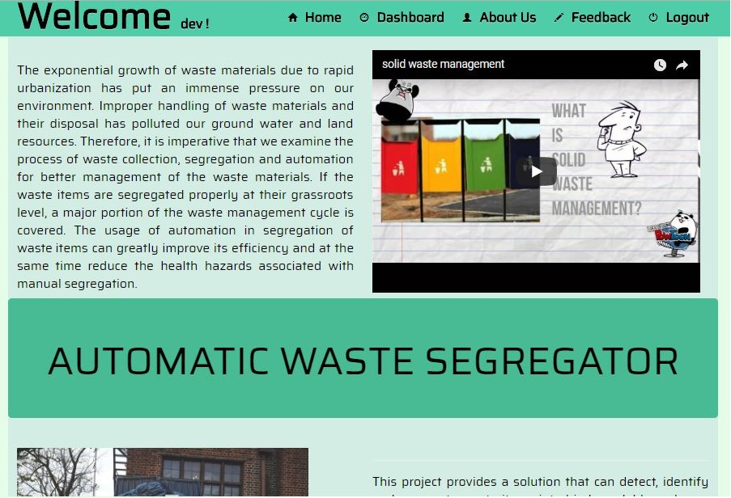
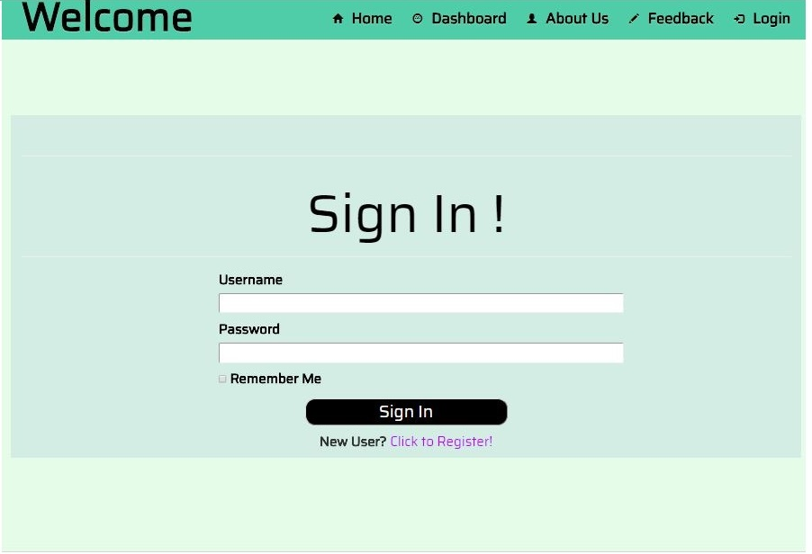
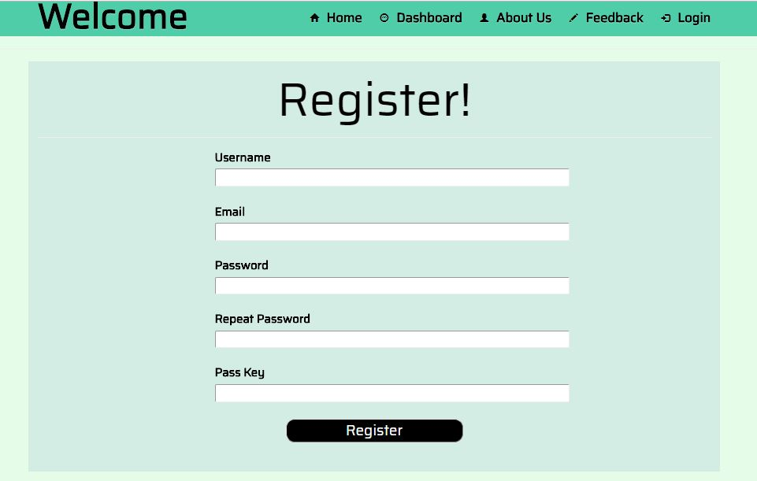
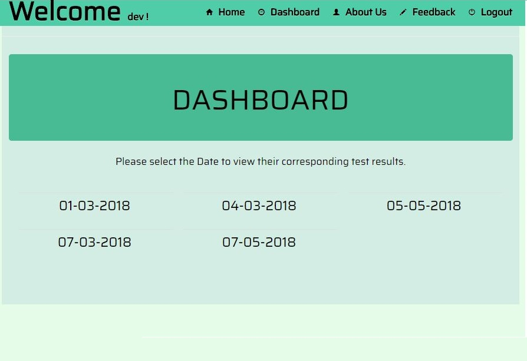
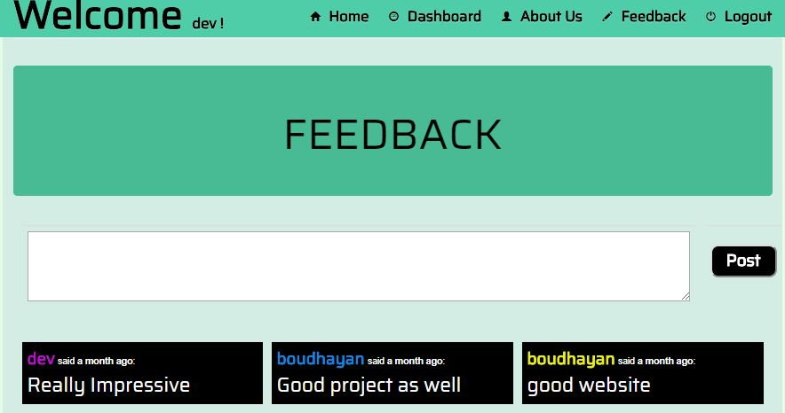
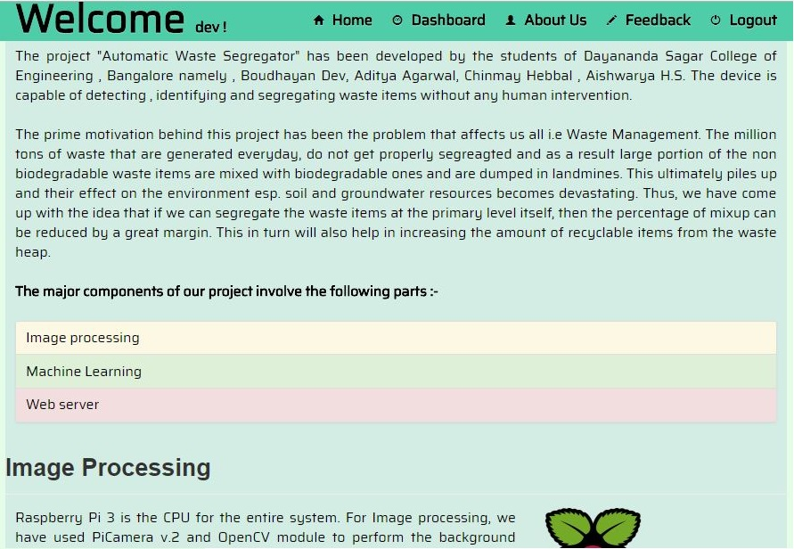

# Waste Segregator Web application
<a href="mailto:dev.dibyo@gmail.com"> </a> [](https://www.python.org/) [](https://github.com/Naereen/StrapDown.js/blob/master/LICENSE)  

This repository contains the source code for the Waste Segregator web application which is a CRUD app built using Flask frmaework.

<h4>Features -</h4>
<li>
  Homepage and About section that describes the aim and operation of the project.
</li>

<li>
  Dashboard that provides admin priviliges to view the archived test results.
</li>
<li>
  Sign In and Register functionality with Feedback feature.
</li>

<h4> Requirements </h4>

* Python 3

* Flask

* Flask plugins - SQLAlchemy , migrate, wtforms, login

* HTML/CSS, Bootstrap.

<h4> Installation </h4>

Type the following command to pull the git repository using terminal-

```
git pull https://github.com/boudhayan-dev/Segregator-FlaskApp 
```
Navigate inside the folder -
```
cd Segregator-FlaskApp/Segregator
```
Set the flask variable -
```
set FLASK_APP=run.py
```

Perform Database migration -
```
flask db init
flask db migrate -m "new db"
flask db upgrade
```

Run the flask app -
```
flask run
```
<br>
<h4>Demonstration</h4>

<table>
	<tr>
		<td>
			
			<h6>&emsp;&emsp;&emsp;&emsp;&emsp;&emsp;&emsp;&emsp;&emsp;&emsp;&emsp;Home Page</h6>
		</td>
		<td>
			
			<h6>&emsp;&emsp;&emsp;&emsp;&emsp;&emsp;&emsp;&emsp;&emsp;&emsp;Sign-In Page</h6>
		</td>
	</tr>
	<tr>
		<td>
			
			<h6>&emsp;&emsp;&emsp;&emsp;&emsp;&emsp;&emsp;&emsp;&emsp;&emsp;&emsp;Registration Page</h6>
		</td>
		<td>
			
			<h6>&emsp;&emsp;&emsp;&emsp;&emsp;&emsp;&emsp;&emsp;&emsp;Dashboard Page</h6>
		</td>
	</tr>
	<tr>
		<td>
			
			<h6>&emsp;&emsp;&emsp;&emsp;&emsp;&emsp;&emsp;&emsp;&emsp;Feedback Page</h6>
		</td>
		<td>
			
			<h6>&emsp;&emsp;&emsp;&emsp;&emsp;&emsp;&emsp;&emsp;&emsp;&emsp;&emsp;About Page</h6>
		</td>
	</tr>
</table>
<br>

<h5>Note:</h5>
This is a part of another project titled - <a href="https://github.com/boudhayan-dev/Automatic-Waste-Segregator"> Automatic Waste Segregator.</a>.
<br>
<br>
© All rights reserved.	